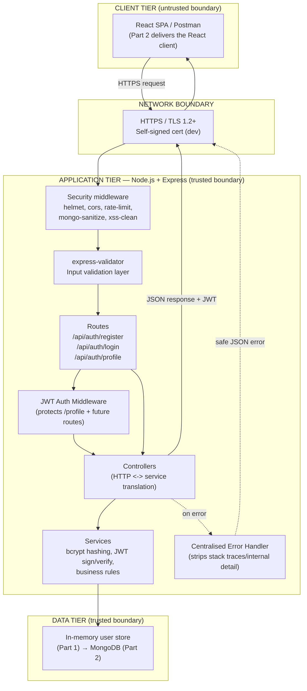

# HustleHub+ — Part 1: Secure Backend Foundations

**Module:** INSY7314
**Team:** Quantum Coder
**POE Stage:** Part 1 of 3 — Secure backend foundations

---

## 1. System Overview

HustleHub+ is a secure freelance marketplace platform that connects two primary groups of users: freelancers, who advertise services ("gigs"), and clients, who browse and book those services (IIE, 2026). Beyond the marketplace mechanics, the platform is required to record the financial transactions generated by bookings and to give freelancers visibility into income earned and estimated tax owed, which means the system handles credentials, transactional records, and income data that all carry a heightened expectation of confidentiality and integrity (IIE, 2026). Because of this sensitivity, the POE brief is explicit that security must be designed in from the outset rather than retrofitted later, and Part 1 operationalises that requirement by building the authentication layer — registration, login, password storage, and token-based session handling — before any marketplace feature is added (IIE, 2026).

### 1.1 Intended Users

The final system supports three roles: **Clients**, who browse and book gigs; **Freelancers**, who list gigs and track income and tax; and **Admins**, who oversee the platform (IIE, 2026). Part 1 does not yet implement role-based *authorization* on marketplace features (there are none yet to protect), but the data model and JWT payload already carry a `role` claim so that Part 2 can layer role-based access control on top without changing the authentication core (Jones, Bradley & Sakimura, 2015).

### 1.2 Development Approach

The POE is deliberately staged across three parts — secure backend foundations, full-stack development, and DevSecOps/finalisation — with each part expected to demonstrably improve on the last (IIE, 2026). This README therefore documents Part 1 as a complete, independently testable slice (registration and login only), structured so that the in-memory user store can be swapped for a MongoDB-backed model in Part 2 without touching the controllers, routes, or security middleware (MongoDB, Inc., n.d.).

---

## 2. Architecture

### 2.1 MERN Architecture Diagram

The diagram below shows the full target MERN architecture (MongoDB, Express, React, Node.js), the trust/system boundaries between them, and where each Part 1 security control sits in the request path (MongoDB, Inc., n.d.). React and MongoDB are shown as forward-looking boundaries for Part 2/3; Part 1 itself implements everything inside the "Node.js/Express API" and "Data Layer" boxes.



The diagram makes the security-relevant boundaries explicit: the **client tier** is untrusted and never holds the JWT secret or password hashes; the **network boundary** is where TLS terminates confidentiality/integrity risk in transit; and the **application tier** is where every request passes through a fixed pipeline (security headers → rate limiting → sanitisation → validation → authentication → business logic → centralised error handling) before a response is ever returned (OWASP, 2021). This layered pipeline reflects the "defence in depth" principle recommended by OWASP, whereby no single control is relied upon exclusively to protect the system (OWASP, 2021).

### 2.2 Request Lifecycle (Login Example)

1. The client sends `POST /api/auth/login` with `email` and `password` in the JSON body, over HTTPS (Mozilla, 2026).
2. `helmet`, `cors`, and the global rate limiter run first, rejecting malformed or excessive traffic before it reaches any business logic (OWASP, 2021).
3. `express-mongo-sanitize` and `xss-clean` strip NoSQL-operator and script-injection payloads from the request body (OWASP, 2024b).
4. `express-validator` rules confirm the email is syntactically valid and the password is present, returning a structured `400` response on failure without touching the user store (OWASP, 2024b).
5. The auth service looks up the user, compares the submitted password against the stored bcrypt hash using a constant-effort comparison, and returns a single generic error for "no such user" and "wrong password" alike, which prevents an attacker from using the login endpoint to enumerate registered emails (OWASP, 2024a).
6. On success, the service signs a JWT containing only the user's `id` and `role`, never the password hash or email, and returns it to the client (Jones, Bradley & Sakimura, 2015).
7. Any unhandled error at any stage is caught by the centralised error handler, which logs full detail server-side but returns only a safe, generic message to the client (OWASP, 2021).

---

## 3. Security Decisions and Rationale

### 3.1 Password Hashing

Plain-text passwords are never stored: every password is hashed with `bcryptjs` at a work factor (cost) of 12 before it touches the in-memory store, and only the resulting hash is persisted (OWASP, 2024a). bcrypt is an adaptive hashing algorithm, meaning the cost factor can be raised over time as hardware gets faster, which keeps offline brute-force attacks computationally expensive even if the data store is later compromised (OWASP, 2024a). OWASP's current guidance places Argon2id above bcrypt for brand-new systems, but explicitly still accepts bcrypt with a work factor of 12 or higher as a secure choice, which is the configuration this project uses (OWASP, 2024a). Verification is done with bcrypt's own constant-time comparison function rather than a manual string comparison, which avoids introducing a timing side-channel into the login flow (OWASP, 2024a).

### 3.2 Token-Based Authentication (JWT)

After a successful login the API issues a JSON Web Token as specified in RFC 7519, a compact, URL-safe, digitally signed structure that lets the server verify a request's identity without keeping server-side session state (Jones, Bradley & Sakimura, 2015). The token is signed with HMAC-SHA256 using a secret loaded from an environment variable rather than hard-coded in source, and it carries only the user's `id` (`sub` claim) and `role`, plus an explicit `exp` (expiry) and `iss` (issuer) claim, so that a stolen token has a bounded lifetime and cannot be replayed against a different issuer (Jones, Bradley & Sakimura, 2015). Every protected route runs the token through `jsonwebtoken`'s verification function on every single request — the signature, issuer, and expiry are all re-checked each time, and a user record lookup confirms the account still exists — rather than being validated once and cached, which is what the POE brief specifically requires (IIE, 2026). Failures are deliberately generic ("Invalid or expired token") so the API never reveals to a caller *why* a token was rejected, which would otherwise assist an attacker in refining an attack (OWASP, 2021).

### 3.3 Input Validation

All fields accepted by the registration and login endpoints are validated with `express-validator` before they reach any controller or service code, following OWASP's allow-list-first approach to input validation rather than trying to filter out "known bad" values (OWASP, 2024b). Email addresses are trimmed, syntax-checked, and normalised; passwords are required to meet a minimum-strength policy (length plus mixed character classes); and the optional `role` field is restricted to a fixed enumeration (`client`, `freelancer`, `admin`) rather than accepting an arbitrary string from the client, which closes off a mass-assignment / privilege-escalation vector that OWASP explicitly flags under Broken Access Control (OWASP, 2021). `express-mongo-sanitize` and `xss-clean` are applied globally as an additional defence-in-depth layer against NoSQL operator injection and reflected script injection respectively, which becomes directly relevant once the in-memory store is replaced with MongoDB in Part 2 (OWASP, 2024b).

### 3.4 HTTPS

The API refuses to start unless a valid TLS key and certificate pair can be loaded, and `src/server.js` binds Node's native `https` module rather than `http`, so there is no accidental unencrypted fallback (Mozilla, 2026). A local self-signed certificate is generated for development via `npm run gen-cert` (wrapping OpenSSL), which is appropriate for local marking and demonstration but is explicitly not suitable for production, where a certificate from a trusted CA would be used instead — a distinction documented here rather than left implicit (Mozilla, 2026). HTTPS matters because, without it, credentials and JWTs would be sent in clear text and could be captured by anyone on the same network path via a manipulator-in-the-middle attack, completely undermining the password-hashing and token-signing work done everywhere else in the system (Mozilla, 2026). `helmet` additionally sets HTTP security headers (including HSTS once deployed behind real TLS in production) so that browsers that do talk to the API are told to prefer HTTPS on subsequent requests (Mozilla, 2026).

### 3.5 Secure Error Handling

A single centralised error-handling middleware (`src/middleware/errorHandler.js`) is the only place in the application that turns an error into an HTTP response, which guarantees consistent behaviour instead of relying on every route to remember to sanitise its own errors (OWASP, 2021). Errors that the application raises on purpose (e.g. "email already registered") carry an explicit `expose = true` flag and a safe message chosen by the developer; anything unexpected — a bug, a dependency failure — falls back to a generic "unexpected error" message with a `500` status, while the *real* error and stack trace are written only to the server-side console log, never returned in the response body (OWASP, 2021). This directly satisfies the POE requirement that error responses must not leak stack traces, file paths, or configuration values (IIE, 2026).

---

## 4. Backend Structure

The codebase follows a layered, modular structure so that each concern can be tested, replaced, or extended independently, which is the separation-of-concerns pattern the rubric explicitly rewards under "Code Structure" (IIE, 2026):

```
hustlehub-backend/
├── src/
│   ├── app.js                 # Express app assembly + global security middleware
│   ├── server.js               # HTTPS server bootstrap
│   ├── config/env.js           # Centralised, validated environment config
│   ├── routes/authRoutes.js    # /api/auth/* route definitions
│   ├── controllers/authController.js  # HTTP <-> service translation only
│   ├── services/authService.js # Hashing, JWT issuance/verification, business rules
│   ├── models/userModel.js     # In-memory data-access layer (swappable for MongoDB)
│   └── middleware/
│       ├── validators.js       # express-validator rule sets
│       ├── authMiddleware.js   # JWT verification + role-based access control
│       └── errorHandler.js     # 404 handler + centralised error responder
├── scripts/generateCert.js     # Local self-signed TLS certificate generator
├── certs/                      # Generated key.pem / cert.pem (git-ignored)
├── postman/HustleHub_Part1.postman_collection.json
├── .env.example
├── package.json
└── README.md
```

Routes only wire HTTP verbs, middleware, and controllers together; controllers only translate between HTTP and the service layer and never contain hashing or token logic directly; and services own all business rules, which means a future switch to a different web framework or a different token library only touches one layer (IIE, 2026).

---

## 5. API Reference

| Method | Endpoint | Auth required | Description |
|---|---|---|---|
| GET | `/health` | No | Liveness check |
| POST | `/api/auth/register` | No | Register a new user (`email`, `password`, optional `role`) |
| POST | `/api/auth/login` | No | Authenticate and receive a JWT |
| GET | `/api/auth/profile` | Yes (Bearer JWT) | Example protected route demonstrating JWT validation |

All responses follow a consistent envelope: `{ "status": "success" | "error", "message": "...", "data": { ... } }`, which the rubric rewards under "consistent response structure" (IIE, 2026).

---

## 6. Setup and Running Locally

```bash
git clone <repository-url>
cd hustlehub-backend
npm install
cp .env.example .env        # then edit JWT_SECRET to a long random value
npm run gen-cert             # generates certs/key.pem and certs/cert.pem
npm start                    # serves https://localhost:5443
```

Requires Node.js 18+ and OpenSSL available on the PATH (Node.js Foundation, n.d.). The server intentionally refuses to start over plain HTTP or without a JWT secret configured, per the security decisions in Section 3.

---

## 7. Testing

### 7.1 Postman Collection

`postman/HustleHub_Part1.postman_collection.json` contains requests demonstrating:
- Successful registration
- Duplicate-email registration (expected `409`)
- Invalid registration input — bad email, weak password (expected `400`)
- Successful login with JWT returned
- Login with the wrong password (expected `401`, generic message)
- Accessing the protected `/profile` route with a valid token (expected `200`)
- Accessing `/profile` with no token and with a malformed token (expected `401`)

Import the collection into Postman, run it against a locally running instance (`npm start`), and set `rejectUnauthorized: false` / disable SSL certificate verification in Postman settings, since the development certificate is self-signed (Postman, n.d.).

### 7.2 Manual verification performed

All of the scenarios above were exercised against the running server during development (see the demonstration video) and returned the expected status codes and response bodies, confirming the "robust implementation … handles edge cases" standard the rubric describes for API functionality (IIE, 2026).

---

## 8. Submission Checklist (Part 1)

- [x] GitHub repository with modular, documented source code
- [x] This README documenting architecture, security rationale, and structure
- [x] Postman collection (`postman/HustleHub_Part1.postman_collection.json`)
- [ ] Screenshots of API responses (add to `/docs/screenshots` before submission)
- [ ] Demonstration video link (add below before submission)
- [ ] 25+ descriptive commits with evidence of multi-member collaboration

**Demonstration video:** _add link here_

---

## 9. Reference List

Internet Engineering Task Force (IETF), 2015. *RFC 7519: JSON Web Token (JWT)*, authored by M. Jones, J. Bradley and N. Sakimura. [online] Available at: https://www.rfc-editor.org/info/rfc7519/ [Accessed 10 August 2026].

MongoDB, Inc., n.d. *MERN Stack Explained*. [online] Available at: https://www.mongodb.com/resources/languages/mern-stack [Accessed 10 August 2026].

Mozilla, 2026. *Transport Layer Security (TLS)*. [online] MDN Web Docs. Available at: https://developer.mozilla.org/en-US/docs/Web/Security/Transport_Layer_Security [Accessed 10 August 2026].

Node.js Foundation, n.d. *Node.js Documentation*. [online] Available at: https://nodejs.org/en/docs [Accessed 10 August 2026].

OWASP, 2021. *OWASP Top 10:2021*. [online] Available at: https://owasp.org/Top10/2021/ [Accessed 10 August 2026].

OWASP, 2024a. *Password Storage Cheat Sheet*. [online] OWASP Cheat Sheet Series. Available at: https://cheatsheetseries.owasp.org/cheatsheets/Password_Storage_Cheat_Sheet.html [Accessed 10 August 2026].

OWASP, 2024b. *Input Validation Cheat Sheet*. [online] OWASP Cheat Sheet Series. Available at: https://cheatsheetseries.owasp.org/cheatsheets/Input_Validation_Cheat_Sheet.html [Accessed 10 August 2026].

Postman, n.d. *Postman Learning Center*. [online] Available at: https://learning.postman.com/ [Accessed 10 August 2026].

The Independent Institute of Education (IIE), 2026. *INSY7314 Portfolio of Evidence Part 1: Secure Foundations — HustleHub+*. Module brief. Johannesburg: The Independent Institute of Education.
